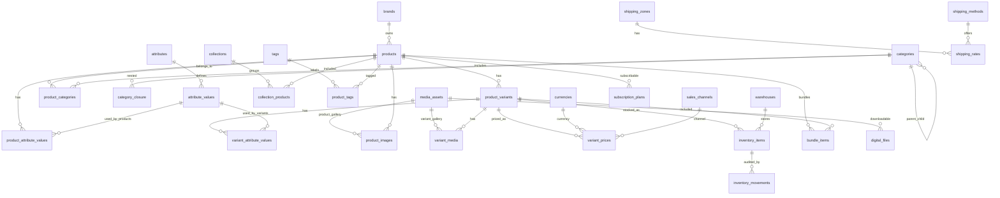

# Catalog Architecture

This project uses a normalized headless-commerce catalog model. The current UI can keep working with legacy product fields while the API and database support category trees, brands, dynamic attributes, variant-specific media/pricing/inventory, and future product types.

## Product Model

Every sellable item resolves to a `product_variants` row. A simple product has one default variant; variable products have many variants.

Supported product types:

- `simple`
- `variable`
- `bundle`
- `digital`
- `subscription`
- `service`

## ERD

## API Boundaries

Admin catalog APIs are exposed under `admin.catalog`:

- `listBrands`, `createBrand`, `updateBrand`
- `listCategories`, `createCategory`, `updateCategory`
- `listAttributes`, `createAttribute`
- `listCollections`, `createCollection`
- `listTags`, `createTag`

Product APIs stay under `admin.products` and carry normalized catalog fields:

- `productType`
- `status`
- `brandId`
- `requiresShipping`
- `isDigital`

## Naming Conventions

- Tables use plural snake case: `product_variants`.
- Columns use snake case in SQL and camel case in Drizzle.
- Stable public identifiers use `slug` or `code`.
- Dynamic attributes use `attributes.code`, not translated names.
- Money is stored as integer minor units per `currency_code`.
- Media is stored once in `media_assets` and attached through join tables.

## Variants and options

- **`product_variants`**: sellable SKU (price, stock, active flag). No duplicated size/color columns.
- **`variant_attribute_values`**: chosen catalog options per variant (size, color, …) from attributes marked `is_variant_option`.
- **`product_attribute_values`**: product-level facts (gender, material, season) shared by all SKUs.

### When size/color apply

Variant-option rules are **catalog-wide**, not per product:

- If **no** attributes have `is_variant_option`, variants need only SKU + price + stock (`optionValues` may be empty).
- If **only size** (or only color) is a variant option, each SKU must set that attribute; the other is not required.
- If **both** are variant options, each SKU must set both. Duplicate SKUs are blocked by unique `sku`; duplicate option combinations are blocked when variant options exist.

## Migration Path

Legacy fields still in use elsewhere:

- `product_images.path`
- `product_variants.price_in_rials` / `stock_quantity` (until `variant_prices` / `inventory_items` fully adopted)
- `order_items.size` / `order_items.color` (order snapshots; resolve from variant options at checkout)

Prefer for new code:

- `brands` + `products.brand_id`
- `media_assets` + `product_images.media_id` / `variant_media`
- `attributes` + `variant_attribute_values` for variant options
- `variant_prices`
- `inventory_items`

## Storefront Filtering

Filterable storefront data should be derived from:

- category tree: `product_categories`, `category_closure`
- brand: `products.brand_id`
- attributes: `product_attribute_values`, `variant_attribute_values`
- price: `variant_prices`
- stock: `inventory_items.quantity_on_hand - inventory_items.quantity_reserved`
- labels: `product_tags`

Avoid filtering against JSON fields unless the data is non-critical metadata.
