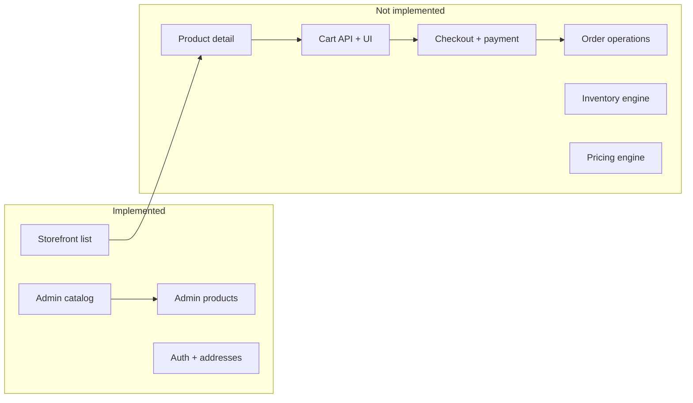
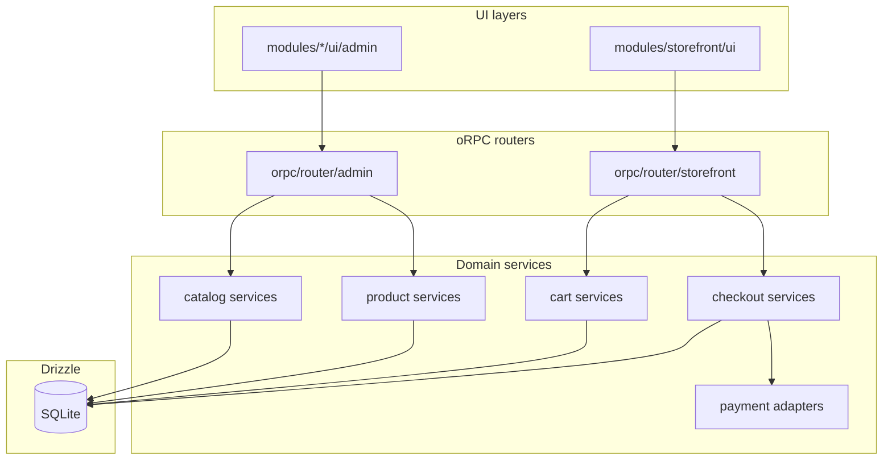

# Sneakstore Ecommerce Gap Analysis And Modular Roadmap

## Executive Summary

Sneakstore is a headless commerce app built with TanStack Start, oRPC, and Drizzle. The database already resembles a WooCommerce-scale catalog plus common commerce extensions, but the commerce runtime is still early: admin catalog/product management is strong, while cart, checkout, fulfillment, pricing, inventory, and payment flows still need domain services and UI.

Best strategy: stop adding tables until existing tables are owned by clear domain modules. Finish vertical slices in this order: catalog, sell, fulfill. Advanced product types such as bundles, subscriptions, and digital downloads should wait until the simple B2C selling loop is stable.

Current product direction: single-store B2C sneaker shop with COD and one online gateway running in parallel.

## Current State

| Area | Status | Key files |
| --- | --- | --- |
| Auth and customer profile | Working | `better-auth`, `src/routes/dashboard/profile.tsx`, `src/orpc/router/address.ts` |
| Admin catalog CRUD | Working | `src/features/admin/catalog/`, `src/orpc/router/admin/catalog.ts` |
| Admin products | Working | `src/features/admin/products/admin-product-editor.tsx` |
| Variants | Partial | Legacy `size`/`color` plus optional catalog attributes |
| Product images | Legacy path | `src/features/admin/products/product-images-section.tsx` uses `product_images.path` |
| Storefront browse | Minimal | `src/features/storefront/storefront-product-browse.tsx` |
| Orders admin | Read-only list | `src/orpc/router/admin/payments.ts` |
| SEO and i18n tables | Schema only | `seo_metadata`, `translations` |



## WooCommerce Gap Comparison

| WooCommerce capability | Schema | App | Recommendation |
| --- | --- | --- | --- |
| Simple and variable products | Yes | Yes | Finish attribute-driven variants |
| Nested categories | Yes | Admin partial | Add full category tree management |
| Brands | Yes | Yes | Optional now; require on publish later |
| Attributes and variations | Yes | Partial | Make `isVariantOption` the source of truth |
| Tags and labels | Yes | Product editor yes | Use on storefront badges |
| Manual collections | Yes | Admin + product assignment | Keep |
| Smart collections | `rulesJson` | No engine | Build evaluator or hide smart type |
| Media library | `media_assets` | Legacy path upload | Migrate uploads to `media_assets` |
| Pricing | `variant_prices` | Legacy variant price | Keep integer rials; display tomans |
| Stock | `inventory_items` | Legacy variant stock | Build inventory service and reservation |
| Cart | `cart_items` | No API/UI | Phase 1 |
| Checkout | `orders` snapshot | No create flow | Phase 1 |
| Coupons | Missing | None | Add after checkout |
| Shipping zones/rates | Yes | None | Phase 2 |
| Payment gateways | Enum only | None | COD first, then gateway adapter |
| Customer order history | Orders exist | No UI | Phase 1/2 |
| Advanced product types | Tables exist | No UI/API | Defer |

## Recommended Modular Structure

Keep TanStack routes thin. Group business capabilities by bounded context under `src/modules/`, while `src/orpc/router/` only wires module API handlers.

```text
src/
  modules/
    catalog/
      schemas/
      services/
      api/
      ui/admin/
    product/
      services/
      ui/admin/
    media/
    pricing/
    inventory/
    cart/
      services/
      ui/storefront/
    checkout/
      services/
      ui/storefront/
    payment/
    order/
    shipping/
    marketing/
    storefront/
    customer/
  orpc/router/
  db/schema.ts
```

Rules:

1. Routers do not contain business rules. They call module services.
2. One write path per aggregate. For example, only `ProductService.update` should touch `products` plus product junction tables.
3. Storefront reads go through query services that join brand, price, stock, and cover image in one place.
4. Product types are feature-flagged. Keep `simple` and `variable` production-ready before enabling bundle, digital, subscription, and service products.



## Architecture Decisions

| Topic | Recommendation |
| --- | --- |
| Money | Store integer rials everywhere; display tomans only in UI |
| Stock | Use `inventory_items` as source of truth; migrate away from `stock_quantity` |
| Variants | Dynamic options from attributes; remove hard dependency on `size`/`color` after migration |
| Images | Use `media_assets` plus `product_images.media_id`; variant gallery through `variant_media` |
| Checkout | Snapshot address on `orders`; compute shipping and discount server-side |
| Payments | `PaymentProvider` interface with `cod` and one gateway adapter |
| Smart collections | JSON rules v1 for brand, category, tag, and attributes; evaluate on product save or scheduled job |
| Coupons | Add `coupons` and `coupon_redemptions`; validate inside checkout service |
| Iran UX | Persian admin, Jalali order dates, province/city addresses |

## Phase 0: Stabilize Foundation

| ID | Task |
| --- | --- |
| `mod-structure` | Introduce `src/modules/`; move business rules out of routers |
| `catalog-migration-finish` | Complete attribute-driven variants, admin category tree, and admin playbook |
| `media-pipeline` | Upload to `media_assets`; link `product_images.media_id`; optional variant image |
| `remove-legacy-variant-fields` | Plan migration from `size`/`color` to attribute-only variants |
| `seo-unify` | Choose either `seo_metadata` or product SEO columns as the single source |

## Phase 1: Storefront That Can Sell

| ID | Task |
| --- | --- |
| `pdp` | Product detail page with gallery, variant selector, price, stock badge, add to cart |
| `cart-api` | `storefront.cart` add/update/remove/list |
| `cart-ui` | Cart page and mini-cart |
| `checkout-api` | Quote totals, shipping placeholder, discount field, create `orders` and `order_items` |
| `checkout-ui` | Checkout steps for address, shipping, payment method, and review |
| `payment-cod` | COD order path |
| `payment-gateway` | Gateway adapter, redirect/callback route, webhook updates |
| `stock-reserve` | Reserve/decrement inventory on order create; prevent oversell |
| `customer-orders` | Customer order list and order detail |

## Phase 2: Admin Operations

| ID | Task |
| --- | --- |
| `admin-orders` | Order detail, status transitions, notes, shipment fields, refund flag |
| `admin-fulfillment` | Bulk status update and packing slip |
| `admin-inventory` | Warehouses UI, stock adjustments, movement audit log |
| `admin-shipping` | Configure zones, methods, rates; connect checkout calculator |
| `admin-coupons` | Coupon CRUD, usage limits, checkout validation |

## Phase 3: Merchandising And Discovery

| ID | Task |
| --- | --- |
| `storefront-filters-v2` | Attribute facets, price range, sorting |
| `collections-smart-engine` | Evaluate `rulesJson` into `collection_products` |
| `homepage` | Featured collections, new arrivals, brand strips |
| `search` | Product search by name, brand, and SKU; consider SQLite FTS later |

## Phase 4: Growth And Polish

| ID | Task |
| --- | --- |
| `emails` | Order confirmation and status emails |
| `analytics` | Revenue, orders, low stock dashboard |
| `import-export` | CSV import/export for products and variants |
| `product-types-advanced` | Digital downloads, bundles, subscriptions |
| `reviews` | Optional product review module |
| `performance` | Image resizing/CDN and PLP query caching |

## Do Not Build Yet

- Multi-vendor commissions
- Multi-currency storefront
- Subscription billing engine
- Page builder or CMS
- Many payment plugins
- Full tax engine before legal/accounting requirements exist

## Suggested Next Five Builds

1. `pdp`, `cart-api`, `cart-ui`
2. `checkout-api`, `checkout-ui`, `payment-cod`
3. `payment-gateway`
4. `stock-reserve`, `inventory`
5. `admin-orders`, `customer-orders`

## Success Metrics

| Phase | Success metric |
| --- | --- |
| Phase 1 | Customer can complete COD or online payment for an in-stock variant; order appears in admin |
| Phase 2 | Admin can ship, cancel, refund, and audit stock movement |
| Phase 3 | Admin can merchandise campaigns through collections and tags without manual product lists |
